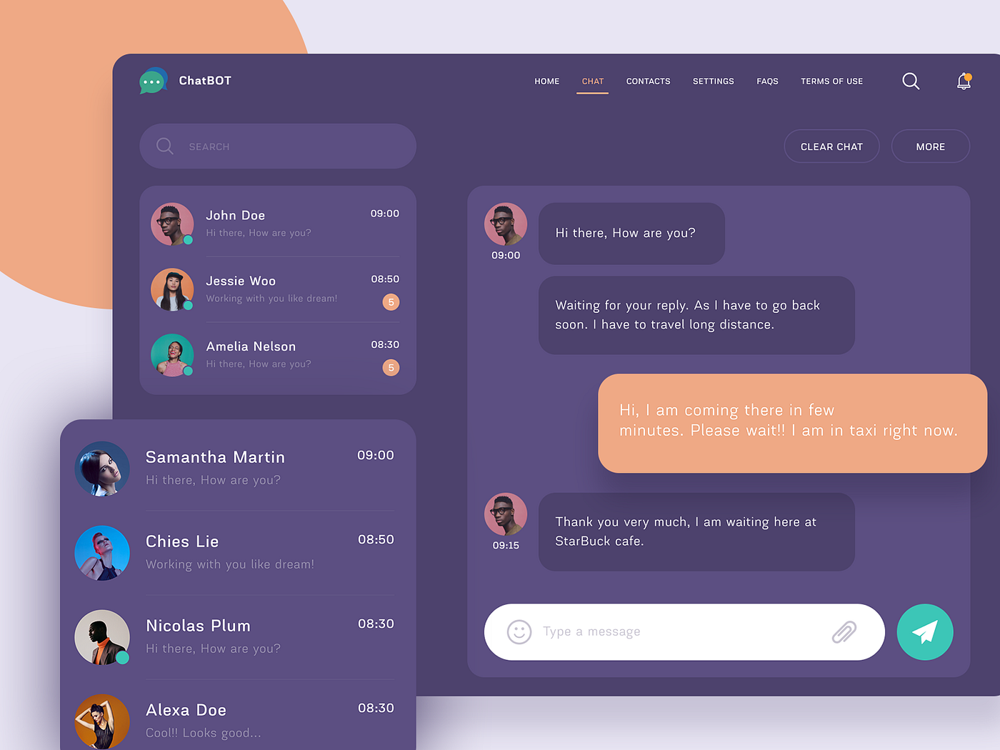

# Real-Time-Chat-app

# Highlights:

🌟 Tech stack: MERN + Socket.io + TailwindCSS + Daisy UI
🎃 Authentication && Authorization with JWT
👾 Real-time messaging with Socket.io
🚀 Online user status
👌 Global state management with Zustand
🐞 Error handling both on the server and on the client
⭐ At the end Deployment like a pro for FREE!
⏳ And much more!

# Build the app
npm run build
# Start the app
npm start